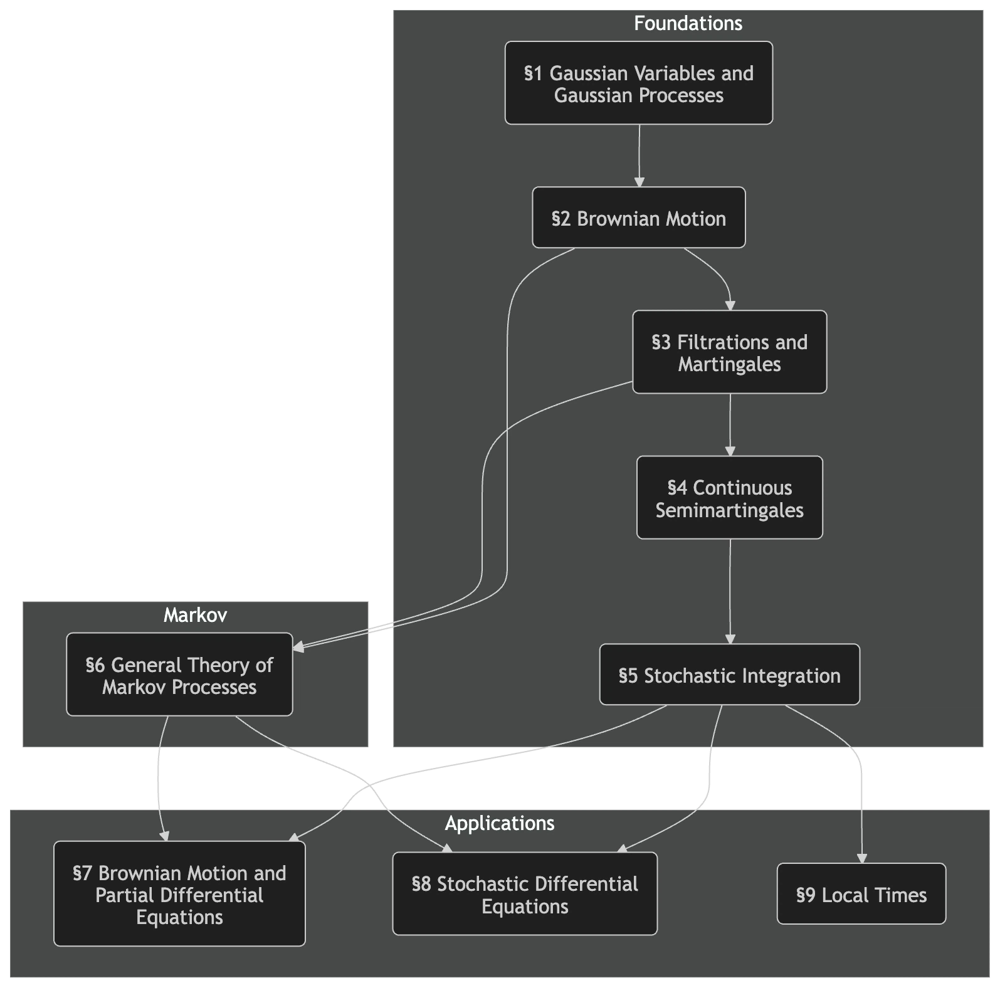

This is a port of the following article.

https://note.com/moni0627/n/n175f0ea41638

---

This is my review of the book named in the title. Whether anyone will actually be inspired by this review to pick up the book is a separate question, but I want to leave these notes here for my own reference as well. I also believe that technical books—not just mathematics books—should always be read more than once, because rereading them when you already know where they are going makes your purpose much clearer. I hope writing this review will serve as my second pass through the book.

https://link.springer.com/book/10.1007/978-3-319-31089-3

## Preface

This was the first specialist book in pure mathematics that I had read in quite some time since finishing graduate school. It belongs to Springer's Graduate Texts in Mathematics series and is therefore aimed at graduate students. My master's specialization was partial differential equations, so I expected my background in another area of analysis to let me move through it smoothly. Instead, the material was quite difficult, and I struggled a great deal. Some of my knowledge had faded, and I was also paying the price for studying carelessly as an undergraduate, so I worked through the gaps by constantly bouncing questions off LLMs (Claude and Gemini). I started on May 1 and, judging by my slow progress, expected it to take the entire month. In the end, I finished my first pass on May 25, although I skipped almost all the exercises. I will use the rest of the month to review the material and write this article.

My reason for reading the book came from investing. Financial assets such as stock prices are modeled as geometric Brownian motion, the solution of the following stochastic differential equation:

$$
dX_t = \sigma X_t \, dB_t + r X_t \, dt
$$

Before reading this book, I could not even state a precise definition of the Brownian motion $${(B_t)_{t \ge 0}}$$ that appears here. The equation above is also merely convenient notation, not a mathematical definition, although it is extremely useful in practice. A stochastic process $${X = (X_t)_{t \ge 0}}$$ is defined to satisfy the stochastic differential equation above when, for every $${t \ge 0}$$,

$$
X_t = X_0 + \int_0^t \sigma X_s \, dB_s + \int_0^t r X_s \, ds \tag{$\ast$}
$$

holds, along with a few additional conditions. The second term on the right, $${\displaystyle \int_0^t \sigma X_s \, dB_s}$$, is called a stochastic integral. Almost surely ($${\text{a.s.}\omega \in \Omega}$$), however, the sample path $${t \mapsto B_t(\omega)}$$ of Brownian motion is not of bounded variation, so this term cannot be defined as a Stieltjes integral. Thus, even after being told that this is the definition of a solution to a stochastic differential equation, we are still left with a mysterious term.

For geometric Brownian motion $${(X_t)_{t \ge 0}}$$ satisfying $${(\ast)}$$, applying Itô's formula to $${\log X_t}$$ gives the explicit solution

$$
X_t = X_0 \exp \left( \sigma B_t + \left(r - \dfrac{\sigma^2}{2} \right)t \right).
$$

In one dimension, Itô's formula states that for a continuous semimartingale $${X}$$ and a twice continuously differentiable function $${f \in C^2(\mathbb R)}$$, $${f(X)}$$ is again a continuous semimartingale and

$$
f(X_t) = f(X_0) + \int_0^t f'(X_s) \, dX_s + \dfrac{1}{2} \int_0^t f''(X_s) \, d \langle X, X \rangle_s.
$$

To understand the geometric Brownian motion $${(\ast)}$$ mathematically, we must therefore define Brownian motion, interpret what (semi)martingales represent, and give the stochastic integral a mathematical meaning. With that motivation, the title *Brownian Motion, Martingales, and Stochastic Calculus* was a perfect fit and drew me to the book. Geometric Brownian motion does appear in Chapter 8, but astonishingly, it receives less than a page of coverage (lol). The chapter is mainly concerned with the existence and uniqueness of solutions under (local) Lipschitz continuity conditions. Its lack of interest in equations that can be solved explicitly also reminded me that I had returned to the world of pure mathematics.

## Overall Assessment

### Difficulty

As I said at the beginning, I think this is a difficult book. In particular, it leaves large gaps for the reader to fill. I repeatedly encountered that familiar experience of a mathematics book calling something “obvious,” “elementary,” “straightforward,” or “easy to verify” when it looked anything but obvious. As one Amazon review says, “It is a good book, but not one for beginners in probability theory.” I think readers need to be thoroughly familiar with Lebesgue integration and probability theory—or, more precisely, arguments involving finite measures. For example, assuming Brownian motion $${(B_t)_{t \ge 0}}$$ is defined on a particular probability space $${(\Omega, \mathscr F, P)}$$, the book describes Wiener measure $${W}$$ as follows:

> Consider $${C(\mathbb R_+, \mathbb R)}$$, the set of continuous functions from $${[0, \infty)}$$ to $${\mathbb R}$$. Define the $${\sigma}$$-algebra $${\mathscr C}$$ as the smallest $${\sigma}$$-algebra for which the coordinate map $${w \mapsto w(t)}$$ is measurable for every $${t \ge 0}$$. This agrees with the Borel $${\sigma}$$-algebra when $${C(\mathbb R_+, \mathbb R)}$$ is equipped with the topology of locally uniform convergence. For Brownian motion $${B = (B_t)_{t \ge 0}}$$, the map $${\Omega \ni \omega \mapsto B_\cdot(\omega) \in C(\mathbb R_+, \mathbb R)}$$ is measurable. Wiener measure—or the law of Brownian motion—$${W(dw)}$$ is the image of the probability measure $${P(d \omega)}$$ under this map. Wiener measure is characterized by its values on cylinder sets. Given $${0 = t_0 < t_1 < \cdots < t_n}$$ and $${A_0, \cdots A_n \in \mathscr B(\mathbb R) }$$, the Wiener measure of $${A = \{ w \in C(\mathbb R_+, \mathbb R) : \forall i, \, w(t_i) \in A_i \}}$$ is $${ W(A) = P(\forall i, \, B_{t_i} \in A_i) = \mathbf{1}_{A_0}(0) \displaystyle \int_{A_1 \times \cdots \times A_n} \dfrac{dx_1 \dots dx_n}{\prod_{i=1}^n (2 \pi (t_i - t_{i-1}))^{1/2}} \exp \left(- \sum_{i=1}^n \dfrac{(x_i - x_{i-1})^2}{2(t_i - t_{i-1})} \right)}$$, where $${x_0 = 0}$$. This uniquely defines the law of Brownian motion.

If you can accept this reasonably smoothly, you probably have what it takes to continue reading. If, like me, your head fills with question marks, reviewing measure theory first would be wise. Here is one example of the background that the book leaves unstated:

Let $${\pi_t: C(\mathbb R_+, \mathbb R) \ni w \mapsto w(t) \in \mathbb R}$$ be the coordinate map. Then $${\mathscr C}$$ is the smallest $${\sigma}$$-algebra containing every inverse image $${\pi_t^{-1}(A), \, A \in \mathscr B(\mathbb R)}$$. On the other hand, $${C(\mathbb R_+, \mathbb R)}$$ is a Fréchet space under the countable family of seminorms $${\displaystyle \|w \|_k = \sup_{0 \le t \le k} |w(t)|}$$, and its Borel $${\sigma}$$-algebra agrees with $${\mathscr C}$$. (Ask an AI for the proof.)

A map $${F: \Omega \to C(\mathbb R_+, \mathbb R)}$$ is measurable if and only if $${\pi_t \circ F}$$ is measurable for every $${t \ge 0}$$. (Proof omitted.) This makes Brownian motion measurable, so Wiener measure can be defined as the pushforward measure $${W = P \circ B^{-1}}$$.

Let $${\mathscr D = \left\{ \displaystyle \bigcap_{i=0}^n \pi_{t_i}^{-1}(A_i) : 0 = t_0 < t_1 < \cdots < t_n, \, A_i \in \mathscr B(\mathbb R) \right\}}$$ be the collection of all cylinder sets. It is a $${\pi}$$-system and satisfies $${\sigma(\mathscr D) = \mathscr C}$$. By Dynkin's $${\pi}$$-$${\lambda}$$ theorem, a measure is uniquely determined once it is defined on $${\mathscr D}$$. (The rest is omitted.) Consequently, defining Wiener measure using a different Brownian motion $${B'}$$ on a different probability space produces the same measure.

### Prerequisites

As explained above, measure theory and probability theory are essential. It goes without saying that calculus, linear algebra, set theory, and topology are also required. The book frequently uses arguments involving Hilbert spaces, so functional analysis is essential as well. A little complex analysis appears, but knowing the Cauchy–Riemann equations seems sufficient; like me, you can probably have forgotten everything else without much trouble.

One disappointment was that the book assumes prior knowledge of discrete-time martingales. For continuous-time martingales, particularly estimates such as Doob's inequalities, it reduces the arguments to discrete time by using the separability of $${\mathbb R_+}$$ and the (right) continuity of sample paths. The underlying discrete-time estimates appear without proof in an appendix, but I do not regard reading propositions without proofs as studying. An enthusiastic reader might want to read the following book by the same author either before or after this one.

### Evaluation

I think it is a good book. Its proofs and arguments are mathematically rigorous, and it contains relatively few typographical errors—not none—so it should help readers build a solid theoretical framework in their minds. For someone with a strong foundation in analysis, it may be a useful introduction to stochastic analysis. After reading it once, you can return to it as a reference book when your memory begins to fade.

Its main shortcoming is, again, the use of propositions about discrete martingales without proof. The book also invokes results such as Kolmogorov's extension theorem without proving them, but those lie somewhat outside the main path of stochastic analysis and did not bother me much. Martingales, even in discrete time, form part of the theory's core, so I hesitate to call the book “self-contained.” Still, it is already almost 300 pages long, so I understand the decision to leave some material to another book. A coherent preparation for research in stochastic analysis might be to take measure theory and functional analysis in the third year of university, then read *Measure Theory, Probability, and Stochastic Processes*, followed by *Brownian Motion, Martingales, and Stochastic Calculus*, in the fourth year.

## Chapter Summaries

### Flowchart

The theory develops according to the flowchart above. The author also included a flowchart in the preface, but I redrew it as a Mermaid diagram. In the following sections, I will look back and forth between the notes I kept and the book and write down my own understanding of each chapter.

### Chapter 1: Gaussian Distributions

(I assigned the chapter titles myself; here and below, they do not follow the book.)

This chapter reviews the material on Gaussian distributions needed for the rest of the book. If you know probability theory and functional analysis, this part should be straightforward. For me, it was the only chapter I could move through quickly. The Gaussian white noise defined here gives the Wiener integral $${\displaystyle \int_0^t f(s) \, dB_s}$$ introduced in Chapter 2. This is a special case of a stochastic integral—an integral with respect to Brownian motion whose integrand is deterministic—and the resulting random variable is again Gaussian.

The book defines white noise for a more general $${\sigma}$$-finite measure space $${(E, \mathscr E, \mu)}$$, without even assuming that $${E}$$ is separable. To read only this book, however, it seems sufficient to consider $${E = \mathbb R_+}$$ with $${\mu}$$ equal to Lebesgue measure. Put simply, without introducing the definition of a Gaussian space, a Gaussian white noise $${G: L^2(\mathbb R_+) \to L^2(\Omega)}$$ is an isometric linear map, and therefore preserves inner products, such that $${G(f)}$$ follows a mean-zero Gaussian distribution; that is, $${\displaystyle G(f) \sim \mathscr N \left(0, \int_0^\infty f(t)^2 \, dt \right)}$$. The book shows that such a $${G}$$ always exists on a suitable $${(\Omega, \mathscr F, P)}$$. Its isometry also gives, for $${0 \le s \le t}$$,

$$
\begin{aligned}E[G(\mathbf 1_{[0, s]}) G(\mathbf 1_{[0, t]})] & = E[G(\mathbb 1_{[0, s]})^2] + E[G(\mathbb 1_{[0, s]})G(1_{(s, t]})] \\&= \int_0^\infty \mathbf 1_{[0, s]}(r) \, dr + \int_0^\infty \mathbf 1_{[0, s]}(r) \mathbf 1_{(s, t]} (r) \, dr \\&= s.\end{aligned}
$$

In particular, $${\operatorname{Cov}(G(\mathbf 1_{[0, s]}), G(\mathbf 1_{[0, t]})) = s \wedge t := \min(s, t)}$$.

### Chapter 2: Brownian Motion

Brownian motion $${(B_t)_{t \ge 0}}$$ is defined as a stochastic process of the form $${B_t = G(\mathbf 1_{[0, t]})}$$ for a Gaussian white noise $${G}$$, with continuous sample paths. In fact, the statement that $${(B_t)_{t \ge 0}}$$ is Brownian motion without assuming continuity is equivalent to saying that it is a mean-zero Gaussian process satisfying $${\operatorname{Cov}(B_s, B_t) = s \wedge t}$$. It could therefore be defined without introducing the more elaborate $${L^2}$$-isometry $${G}$$. I think Gaussian white noise is introduced first both to make the existence of Brownian motion obvious and to define the Wiener integral naturally by

$$
\int_s^t f(r) \, dB_r := G(f \mathbf 1_{(s, t]}).
$$

Even if Brownian motion were defined first, the Wiener integral could still be obtained by noting that step functions are dense in $${L^2(\mathbb R_+)}$$, that $${\mathbf 1_{(s, t]} \to B_t - B_s}$$ is an $${L^2}$$-isometry, and that linearity and the closedness of Gaussian spaces allow an extension to $${L^2(\mathbb R_+)}$$. Thus, which one comes first is a minor question.

We have already established the existence of $${G}$$, but Brownian motion requires continuous sample paths. Another important concept from this point onward is a modification $${(\tilde X_t)_ {t \in T}}$$ of a stochastic process $${(X_t)_{t \in T}}$$, meaning that $${X_t = \tilde X_t}$$ almost surely for every $${t \in T}$$. Kolmogorov's continuity theorem (Kolmogorov's lemma) gives the following sufficient condition for a process to have a modification with continuous sample paths:

$$
\exists q, \varepsilon, C > 0, \, E[d(X_s, X_t)^q] \le C|t - s|^{1 + \varepsilon}.
$$

In fact, it implies local Hölder continuity. For the Brownian motion defined by $${G}$$ without any prior guarantee of continuity, $${B_t - B_s \sim \mathscr N(0, t - s)}$$ implies that, for every $${q > 0}$$,

$$
E[|B_t - B_s|^q] = C_q (t-s)^{q/2}.
$$

This establishes the existence of Brownian motion, meaning a continuous modification.

### Chapter 3: Martingales and Stopping Times

This chapter introduces a filtration $${(\mathscr F_t)_{t \in [0, \infty]}}$$ and stopping times $${T}$$. At first, the definition of a stopping time, $${\forall t \ge 0, \, \{ T \le t \} \in \mathscr F_t}$$, meant little to me. It turns out to be an extremely important concept used repeatedly in later proofs. I think the following proposition is particularly important:

Let $${(X_t)_{t \ge 0}}$$ be a stochastic process with continuous sample paths taking values in a metric space $${(E,d)}$$. If $${F \subset E}$$ is closed, then $${T_F := \inf \{ t \ge 0 : X_t \in F \}}$$ is a stopping time.

A frequently used proof technique is to define $${T_n := \inf \{t \ge 0 : |X_t| \ge n \}}$$ for a stochastic process $${(X_t)_{t \ge 0}}$$ with continuous sample paths, and then define the stopped process $${X^{T_n}}$$ by $${X^{T_n}_t = X_{t \wedge T_n}}$$. In other words, continuity and the intermediate value theorem mean that each sample path stops forever once $${|X_t| = n}$$. By definition, $${|X^{T_n}_t| \le n}$$. Since $${T_n \nearrow \infty}$$ as $${n \to \infty}$$, we have $${X_{t \wedge T_n} \to X_t}$$, reducing arguments about the stochastic process to the bounded case. To see that $${\displaystyle \lim_{n \to \infty} T_n = \infty}$$, monotonicity gives a limit $${\displaystyle M = \lim_{n \to \infty} T_n \in [0, \infty]}$$. If $${M < \infty}$$, then $${\forall n \in \mathbb N, T_n \le M}$$, which implies $${\forall n \in \mathbb N, \exists t_n \in [0, M], |X_{t_n}| \ge n}$$. On the other hand, continuity of the sample paths and the extreme value theorem give $${\displaystyle \sup_{t \in [0, M]} |X_t| < \infty}$$, a contradiction.

This was also my first encounter with martingales. Even after seeing the definition $${E[M_t \mid \mathscr F_s] = M_s}$$ and hearing an AI explain it as a “fair game,” my reaction was little more than “well, of course.” Yet this property is extremely strong and leads to a wide range of results. One of the first is the martingale convergence theorem:

> Let $${(M_t)_{t \ge 0}}$$ be a martingale with right-continuous sample paths. The following are equivalent: (1) $${\exists Z \in L^1(\Omega), \, \forall t \ge 0, \, M_t = E[Z \mid \mathscr F_t] }$$; (2) $${\{M_t\}_{t \ge 0}}$$ is uniformly integrable; and (3) $${\displaystyle \exists Z \in L^1(\Omega), \, \lim_{t \to \infty} E[|Z - M_t|] = 0}$$. When these conditions hold, writing the limit as $${M_\infty}$$ gives $${M_t = E[M_\infty \mid \mathscr F_t]}$$.

Another important result is the following corollary of the optional stopping theorem:

> Let $${(M_t)_{t \ge 0}}$$ be a martingale with right-continuous sample paths, and let $${T}$$ be a stopping time. Then $${{M^T} = (M_{t \wedge T})_{t \ge 0}}$$ is also a martingale. If $${(M_t)_{t \ge 0}}$$ is uniformly integrable, then $${(M_{t \wedge T})_{t \ge 0}}$$ is uniformly integrable as well, and $${M_{t \wedge T} = E[M_T \mid \mathscr F_t]}$$.

Brownian motion is itself a martingale; in fact, it has the still stronger property of independent increments. As discussed in connection with stopping times, even if a martingale $${(M_t)_{t \ge 0}}$$ such as Brownian motion is not uniformly integrable, $${M_{t \wedge T_n}}$$ is bounded—a much stronger condition—so we can apply convergence theorems and the $${L^2}$$ properties discussed below.

I may sound authoritative here, but uniform integrability is a concept useful in finite-measure settings such as probability theory. Having specialized in partial differential equations, where I used little beyond Lebesgue measure, I could not even state its definition. I peppered the AI with questions and reviewed results such as Vitali's convergence theorem. I regard my university and graduate-school years as the period when I studied hardest, but this drove home that no matter how much you study, a day will come when you wish you had studied more.

### Chapter 4: Processes of Bounded Variation and Semimartingales

Here comes part two of “I wish I had studied more.” The chapter introduces functions of bounded variation and their associated signed measures. It is easier to follow if you understand how the Hahn decomposition of a signed measure $${\mu}$$ and the associated Jordan decomposition $${\mu = \mu^+ - \mu^-}$$ give the representation $${|\mu| = \mu^+ + \mu^-}$$ of the total variation measure, and how a function of bounded variation $${f}$$ can be expressed, using its variation

$$
V_0^t(f) := \sup \left\{ \sum_{i=1}^n |f(t_i) - f(t_{i-1})| : 0 = t_0 < t_1 < \cdots < t_n = t \right\},
$$

as the difference of two increasing functions:

$$
f(t) = \dfrac{1}{2} (V_0^t(f) + f(t)) - \dfrac{1}{2}(V_0^t(f) - f(t)) =: f^+(t) - f^-(t).
$$

Their Stieltjes measures $${df^{\pm}}$$ agree with the Jordan components $${\mu^{\pm}}$$. Here again, I paid the price for my unserious attitude of assuming that a rough understanding was enough because the topic was unrelated to partial differential equations.

A continuous semimartingale itself is not a particularly difficult concept: $${X}$$ is a continuous semimartingale if it can be written $${X = M + V}$$, where $${M}$$ is a continuous local martingale and $${V}$$ is a continuous process of bounded variation. A continuous local martingale is defined by the existence of stopping times $${(T_n)_{n \in \mathbb N}}$$ such that $${T_n \nearrow \infty}$$ and $${M^{T_n}}$$ is uniformly integrable for every $${n \in \mathbb N}$$. Moreover, for a continuous local martingale with $${M_0 \in L^1}$$, the stopping times $${T_n = \inf\{ t \ge 0 : |M_t| \ge n \}}$$ defined earlier satisfy these conditions, so in practice we can always use them. Surprisingly, a process $${(M_t)_{t \ge 0}}$$ is both a local martingale and of bounded variation only when $${M_t = M_0}$$. Thus, if—as in this book—the definition of a process of bounded variation includes $${V_0 = 0}$$, the semimartingale decomposition $${X = M + V}$$ is unique.

It also follows that nontrivial (local) martingales, including Brownian motion, are not of bounded variation. Nevertheless, the sum of squared variations called the quadratic variation $${\langle M, M \rangle_t}$$, which appeared in Itô's formula at the beginning, does converge. More precisely:

> Let $${(M_t)_{t \ge 0}}$$ be a continuous local martingale. For every $${t > 0}$$, let $${0 = t_0^n < \cdots < t_{p_n}^n = t}$$ be an increasing sequence of partitions of $${[0, t]}$$—that is, $${\forall n, \, \forall i, \, \exists j, \, t_i^n = t_j^{n+1}}$$—such that $${\displaystyle \lim_{n \to \infty} \max_{1 \le i \le p_n} (t_i^n - t_{i-1}^n) = 0 }$$. Then $${\displaystyle \sum_{i=1}^{p_n} (M_{t_i^n} - M_{t_{i-1}^n})^2 }$$ converges in probability as $${n \to \infty}$$. Denoting the limit by $${\langle M, M \rangle_t}$$, the process $${\langle M, M \rangle_t}$$ is characterized as the unique continuous increasing process for which $${M_t^2 - \langle M, M \rangle_t}$$ is a continuous local martingale.

In particular, Brownian motion $${(B_t)_{t \ge 0}}$$ satisfies $${\langle B, B \rangle_t = t}$$. This follows from its independent increments, since

$$
\begin{aligned}E[B_t^2 \mid \mathscr F_s] &= E[\{ (B_t - B_s) + B_s \}^2 \mid \mathscr F_s] \\&= E[(B_t - B_s)^2] + 2E[B_t - B_s]B_s + B_s^2 \\&= t - s + B_s^2,\end{aligned}
$$

so $${B_t^2 - t}$$ is a martingale.

Adding a process of bounded variation does not change the limit of these sums of squared variations. Expanding gives

$$
\begin{aligned}& \sum_{i=1}^{p_n} \{ (M_{t_i^n} + V_{t_i^n}) - (M_{t_{i-1}^n} + V_{t_{i-1}^n}) \}^2 \\= & \sum_{i=1}^{p_n} (M_{t_i^n} - M_{t_{i-1}^n})^2 + 2\sum_{i=1}^{p_n}(M_{t_i^n} - M_{t_{i-1}^n})(V_{t_i^n} - V_{t^n_{i-1}}) + \sum_{i=1}^{p_n}(V_{t^n_i} - V_{t^n_{i-1}})^2.\end{aligned}
$$

Then, by uniform continuity of the sample paths on $${[0, t]}$$, for sufficiently large $${n}$$,

$$
\begin{aligned}& \left| \sum_{i=1}^{p_n}(M_{t^n_i} - M_{t^n_{i-1}})(V_{t^n_i} - V_{t^n_{i-1}}) \right| \\
\le & \max_{1 \le i \le p_n} | M_{t^n_i} - M_{t^n_{i-1}} | \sum_{i=1}^{p_n} |V_{t^n_i} - V_{t^n_{i-1}}| \\
\le & \varepsilon V_0^t(f),\end{aligned}
$$

and the other term is handled similarly. The quadratic variation of a continuous semimartingale $${X = M + V}$$ is therefore naturally defined as $${ \langle X, X \rangle = \langle M, M \rangle }$$. Quadratic variation also admits the bilinear extension $${\langle X, Y \rangle = \dfrac{1}{2} (\langle X+Y, X+Y \rangle - \langle X, X \rangle - \langle Y, Y \rangle) }$$. Since $${\langle M, M \rangle_t}$$ is a continuous increasing process, $${\langle X, Y \rangle_t}$$ is a continuous process of bounded variation.

### Chapter 5: Stochastic Integrals

This is the heart of the book, occupying more than 50 pages by itself. One of the chapter's goals is to define the stochastic integral

$$
\int_0^t H_s \, dX_s = \int_0^t H_s \, dM_s + \int_0^t H_s \, dV_s
$$

for a semimartingale—I will omit “continuous” because it is cumbersome—$${X = M + V}$$ and a suitable stochastic process $${(H_t)_{t \ge 0}}$$ serving as the integrand. The integral with respect to $${dV_s}$$ is a Stieltjes integral, so if $${H_t}$$ is locally bounded, meaning that $${\displaystyle \sup_{0 \le s \le t }|H_s| < \infty}$$ almost surely for every $${t \ge 0}$$, it can be defined because $${\displaystyle \left| \int_0^t H_s \, dV_s \right| \le \int_0^t |H_s| \, |dV_s| < \infty}$$. The remaining goal is therefore to define stochastic integration with respect to a local martingale.

By analogy with the Riemann–Stieltjes integral, we expect a property such as

$$
\displaystyle \lim_{n \to \infty} \sum_{i=1}^{p_n} f(c^n_i) (g(t^n_i) - g(t^n_{i-1})) = \int_0^t f(s) \, dg(s), \,\, \forall c^n_i \in [t^n_{i-1}, t^n_i].
$$

This is indeed true to a point. When $${(X_t)_{t \ge 0}}$$ is a continuous semimartingale and $${(H_t)_{t \ge 0}}$$ is continuous, one important convergence theorem for stochastic integrals states that

$$
\operatorname*{plim}_{n \to \infty} \sum_{i=1}^{p_n} H_{t^n_{i-1}} (X_{t^n_i} - X_{t^n_{i-1}}) = \int_0^t H_s \, dX_s.
$$

When $${H_t}$$ is itself a semimartingale, the following observation shows why the integrand must be evaluated at the left endpoint $${t^n_{i-1}}$$ of each subinterval: choosing a different point changes the limit in probability.

$$
\begin{aligned}& \sum_{i=1}^{p_n} H_{t^n_{i}} (X_{t^n_i} - X_{t^n_{i-1}}) \\= & \sum_{i=1}^{p_n} H_{t^n_{i-1}} (X_{t^n_i} - X_{t^n_{i-1}}) + \sum_{i=1}^{p_n} (H_{t^n_i} - H_{t^n_{i-1}}) (X_{t^n_i} - X_{t^n_{i-1}}) \\\xrightarrow{p} & \int_0^t H_s \, dX_s + \langle H, X \rangle_t.\end{aligned}
$$

Chapter 4 showed that the quadratic covariation $${\langle H, X \rangle_t}$$ is identically zero when either argument is of bounded variation. Conversely, when neither is of bounded variation, it is not zero; the effect of integrating with respect to a process that is not of bounded variation appears as the quadratic covariation.

We want to define stochastic integration with respect to a local martingale $${(M_t)_{t \ge 0}}$$. Very loosely speaking, it is enough to construct the theory under reasonably well-behaved assumptions because we can reduce to stopped processes. Indeed, $${\displaystyle \int_0^t H_s \, dM_s}$$ can be viewed as stopping at the constant stopping time $${T=t}$$, and more generally $${\displaystyle \int_0^T H_s \, dM_s = \int_0^\infty H_s \, dM^T_s}$$. Also speaking loosely and without justification, the analogy with the Riemann–Stieltjes sums above means it suffices to consider $${M_0 = 0}$$. The definition uses the Hilbert-space structure of $${L^2}$$, and the following powerful property promotes a local martingale to a martingale:

Let $${(M_t)_{t \ge 0}}$$ be a continuous local martingale with $${M_0 = 0}$$. The following are equivalent: (1) $${M}$$ is an $${L^2}$$-bounded martingale, meaning $${\displaystyle \sup_{t \ge 0} E[M_t^2] < \infty}$$; and (2) $${E[\langle M, M \rangle_\infty^2] < \infty}$$. When these hold, $${M_t^2 - \langle M, M \rangle_t}$$ is a uniformly integrable martingale, and in particular $${E[M_\infty^2] = E[\langle M, M \rangle_\infty]}$$.

Chapter 2 defined the Wiener integral using Gaussian white noise. Yet even there, explicit calculations can only be performed for step functions using $${\displaystyle \int_s^t dB_s = G(\mathbf 1_{(s, t]}) = B_t - B_s}$$. For a general $${f \in L^2(\mathbb R_+)}$$, the only definition provided uses the density of step functions to approximate it. Since the Wiener integral is a special case of the stochastic integral, we may as well resign ourselves to constructing stochastic integrals in the same way.

Let $${\mathbb H^2}$$ be the set of all $${L^2}$$-bounded martingales $${(M_t)_{t \ge 0}}$$ with $${M_0 = 0}$$. It is a Hilbert space with inner product $${(M, N)_{\mathbb H^2} = E[\langle M, N \rangle_\infty] = E[M_\infty N_\infty]}$$. Fix $${M \in \mathbb H}$$, and define the Hilbert space $${L^2(M)}$$ to consist of stochastic processes satisfying $${\displaystyle \|H\|_{L^2(M)} := E \left[\int_0^\infty H_s^2 \, \langle M, M \rangle_s \right]^{1/2} < \infty}$$, where the integral is a Stieltjes integral. A dense subspace consists of all stochastic processes of the form

$$
H_s(\omega) = \sum_{i=1}^p H_{(i - 1)} (\omega) \mathbf 1_{(t_{i-1}, t_i]}(s),
$$

where each $${H_{(i-1)}}$$ is bounded and $${\mathscr F_{t_{i-1}}}$$-measurable. Defining the stochastic integral for such processes by

$$
\int_0^t H_s \, dM_s = (H \cdot M)_t = H_{(i-1)} (M_{t_i \wedge t} - M_{t_{i-1} \wedge t}),
$$

we obtain

$$
\begin{aligned}\langle H \cdot M, H \cdot M \rangle_t &= \sum_{i, j = 1}^p \langle H_{(i-1)} (M_{t_i \wedge t} - M_{t_{i-1} \wedge t}), H_{(j-1)}(M_{t_j \wedge t} - M_{t_{j-1} \wedge t}) \rangle \\&= \sum_{i=1}^p \langle H_{(i-1)} (M_{t_i \wedge t} - M_{t_{i-1} \wedge t}), H_{(i-1)}(M_{t_i \wedge t} - M_{t_{i-1} \wedge t}) \rangle \\&= \sum_{i=1}^p H_{(i-1)}^2(\langle M, M \rangle_{t_i \wedge t} - \langle M, M \rangle_{t_{i-1} \wedge t}) \\&= \int_0^t H_s^2 \, d \langle M, M \rangle_s.\end{aligned}
$$

The intermediate steps can be established using approximations of the quadratic covariation $${\langle M, N \rangle_t}$$. Furthermore, $${H_{(i-1)} (M_{t_i \wedge t} - M_{t_{i-1} \wedge t})}$$ is a martingale for each $${i}$$, so $${H \cdot M}$$ belongs to $${\mathbb H^2}$$, and the correspondence $${H \mapsto H \cdot M}$$ is an isometry. Extending this map defines the stochastic integral $${H \cdot M \in \mathbb H^2}$$ for every $${H \in L^2(M)}$$ and $${M \in \mathbb H^2}$$.

Extending this construction to local martingales shows that the stochastic integral is a local martingale, but of course does not imply that it belongs to $${\mathbb H^2}$$. If, however, for some $${t \in [0, \infty]}$$,

$$
E\left[ \int_0^t H_s^2 \, d\langle M, M \rangle_s \right] < \infty,
$$

then viewing it as an integral with respect to the stopped process $${M^t}$$ for $${T=t}$$ gives $${(H \cdot M)^t \in \mathbb H^2}$$. In particular, it is a martingale and satisfies the isometry

$$
E \left[ \left( \int_0^t H_s \, dM_s \right)^2 \right] = E \left[ \int_0^t H_s^2 \, d \langle M, M \rangle_s \right].
$$

This chapter contains much more important material, but I will finish by discussing Itô's formula, which appeared at the beginning, and the explicit solution of geometric Brownian motion, although the existence of that solution has not yet been guaranteed at this point. The formal statement of Itô's formula is as given earlier, but the following form is useful for actual calculations:

$$
df(X_t) = f'(X_t) \, dX_t + \dfrac{1}{2} f''(X_t) \, d\langle X, X \rangle_t.
$$

Suppose $${X_t}$$ satisfies the stochastic differential equation for geometric Brownian motion, $${dX_t = \sigma X_t \, dB_t + rX_t \, dt}$$. Applying Itô's formula to $${\log X_t}$$ gives

$$
\begin{aligned}d \log X_t &= \dfrac{dX_t}{X_t} - \dfrac{1}{2} \dfrac{d \langle X, X \rangle_t}{X_t^2} \\&= \dfrac{\sigma X_t \, dB_t + r X_t \, dt}{X_t} - \dfrac{1}{2} \dfrac{\sigma^2 X_t^2 \, d \langle B, B \rangle_t}{X_t^2} \\&= \sigma \, dB_t + r \, dt - \dfrac{1}{2} \sigma^2 \, d \langle B, B \rangle_t \\&= \sigma \, dB_t + \left(r - \dfrac{1}{2} \sigma^2 \right) dt,\end{aligned}
$$

which yields the solution. These formal calculations are justified by the following two associative laws:

- $${K \cdot (H \cdot X) = (HK) \cdot X}$$
- $${\langle H \cdot X, K \cdot Y \rangle = (HK) \cdot \langle X, Y \rangle}$$

Apply them respectively to $${\dfrac{1}{X} \cdot X}$$ and $${\dfrac{1}{X^2} \cdot \langle X, X \rangle}$$, then substitute $${X_t = X_0 + ((\sigma X) \cdot B)_t + ((rX) \cdot \mathbf 1_\Omega\text{id})_t}$$.

### Chapter 6: Markov Processes

This chapter has a rather different flavor from what came before. Chapter 2 already established the Markov property of Brownian motion, but I think the purpose here is to examine it for a broader class of stochastic processes. In particular, the chapter considers the strong continuity assumptions of a Feller semigroup. This reminded me nostalgically of the Hille–Yosida theorem from functional analysis, although I had completely forgotten what that theorem actually says.

A Feller semigroup $${(Q_t)_{t \ge 0}}$$ assigns a probability measure $${Q_t(x, \cdot)}$$ to each $${x \in \mathbb R^d}$$, and the operators

$$
Q_tf(x) = \int_{\mathbb R^d} f(y) \, Q_t(x, dy)
$$

form a $${C_0}$$-semigroup on $${C_0(\mathbb R^d)}$$. An $${\mathbb R^d}$$-valued stochastic process $${X_t}$$ is a Markov process with semigroup $${(Q_t)_{t \ge 0}}$$ if, for every $${f \in L^\infty(\mathbb R^d)}$$ and $${0 \le s \le t}$$,

$$
E[f(X_t) \mid \mathscr F_s] = Q_{t-s}f(X_s) = \int_{\mathbb R^d} f(x) \, Q_{t-s}(X_s, dx).
$$

In other words, even with all information up to $${\mathscr F_s}$$, the distribution of $${X_t}$$ depends only on the current value $${X_s}$$ and is $${Q_{t-s}(X_s, \cdot)}$$. We have not established the existence of such a Markov process, although one can always be constructed. If $${X}$$ is a Markov process, repeatedly taking conditional expectations shows inductively that its finite-dimensional marginal distribution, for $${0 = t_0 < t_1 < \cdots < t_n}$$ and $${A_0, \cdots A_n \in \mathscr B(\mathbb R^d)}$$, is

$$
\begin{aligned}& P(\forall i, \, X_{t_i} \in A_i) \\ =& \int_{A_0}\int_{A_1}\int_{A_2} \cdots \int_{A_n} Q_{t_n - t_{n-1}}(x_{n-1}, dx_n) \cdots Q_{t_2 - t_1}(x_1, dx_2)Q_{t_1}(x_0, dx_1) \gamma(dx_0),\end{aligned}
$$

where $${\gamma}$$ is the law of $${X_0}$$, $${\gamma = P \circ X_0^{-1}}$$. Thus, the distribution of a Markov process with Feller semigroup $${(Q_t)_{t \ge 0}}$$ is uniquely characterized by the distribution of $${X_0}$$. A $${d}$$-dimensional Brownian motion is a Markov process with a Feller semigroup when $${Q_t(x, dy) = p_t(y - x) \, dy}$$, using the Gaussian kernel $${p_t(x) = \dfrac{1}{(2 \pi t)^{d/2}} \exp \left(- \dfrac{|x|^2}{2t} \right)}$$. Substituting this into the expression for the marginal distributions recovers the values of Wiener measure on cylinder sets described at the beginning.

Very loosely, the ordinary Markov property says that for every $${s \ge 0}$$, conditional on the information in $${\mathscr F_s}$$, the distribution of the Markov process $${(X_{s + t})_{t \ge 0}}$$ equals that of a Markov process $${(X'_t)_{t \ge 0}}$$ with $${X'_0 = X_s}$$. Applied to Brownian motion $${(B_t)_{t \ge 0}}$$, conditional on $${\mathscr F_s}$$ we have $${B_{s+t} \overset{(d)} = \beta_t + B_s}$$, where $${\beta_t}$$ is another Brownian motion and $${\overset{(d)}{=}}$$ denotes equality in distribution. Independent increments and $${B_{s+t} = (B_{s+t} - B_s) + B_s \overset{(d)}{=} \beta_t + B_s}$$ show that knowing $${\mathscr F_s}$$ provides no information beyond fixing $${B_s}$$. Consequently, $${(B_{s+t} - B_s)_{t \ge 0}}$$ is a Brownian motion independent of $${\mathscr F_s}$$. The strong Markov property asserts that the same remains true when the time $${s}$$ is replaced by a stopping time $${T}$$, and Markov processes with Feller semigroups satisfy it.

### Chapter 7: Partial Differential Equations

This chapter is completely independent, so you can safely skip it if you like. The author even mentions in Chapter 8 that it is independent of Chapter 7. The first half examines properties of harmonic functions satisfying Laplace's equation from the perspective of Brownian motion. These results can also be proved by ordinary partial-differential-equation methods without stochastic processes, so although the viewpoint is interesting, it does not produce especially novel results. I think this part mainly prepares for the second half.

The second half is more interesting and discusses the recurrence—or transience—and asymptotic behavior of $${d}$$-dimensional Brownian motion. By analogy with the fact that a discrete-time random walk is recurrent in two or fewer dimensions, always returning to its starting point, and transient in three or more dimensions, consider Brownian motion with $${B_0 = x \in \mathbb R^d \setminus \{0\}}$$ and the stopping time $${U_r = \inf \{ t \ge 0 : |B_t| = r \}}$$ for $${0 \le r < |x|}$$. When $${d \ge 2}$$, $${P(U_0 < \infty) = 0}$$, while for $${r > 0}$$,

$$
P(U_r < \infty) = \begin{cases}1 \quad & d = 2 \\\left(\dfrac{r}{|x|}\right)^{d-2} \quad & d \ge 3.\end{cases}
$$

In two dimensions, the probability of reaching the origin—and hence any particular point other than $${x}$$—is zero, yet the process eventually visits every arbitrarily small ball. In three or more dimensions, even that is not guaranteed.

### Chapter 8: Stochastic Differential Equations

I have already written what I wanted to say in the preface and Chapter 5. As in the proof of existence and uniqueness for ordinary differential equations, the chapter assumes Lipschitz continuity of $${\sigma, b}$$ in the stochastic differential equation

$$
\begin{aligned}& dX_t = \sigma(t, X_t) \, dB_t + b(t, X_t) \, dt \\\overset{\text{def}}{\iff} & X_t = X_0 + \int_0^t \sigma(s, X_s) \, dB_s + \int_0^t b(s, X_s) \, ds\end{aligned} \tag{$\ast \ast$}
$$

and then grinds through the calculations using Grönwall's inequality and Picard iteration. After proving existence and uniqueness, it examines three stochastic differential equations, including geometric Brownian motion. When an equation can be solved, Itô's formula gives an explicit solution; when it cannot, the book studies its behavior using stopping times.

In relation to the Markov property, under the Lipschitz conditions the solution to $${(\ast \ast)}$$ is a Markov process with a Feller semigroup and therefore satisfies the strong Markov property. Its generator can also be written explicitly. The book does not develop the subject much further, however, so perhaps this is intended as an invitation to pursue the area if it interests you.

### Chapter 9: Local Time

This is a rather mysterious chapter—or perhaps I should say that considering a mysterious stochastic process called local time somehow produces all sorts of properties, which means I did not understand it very well. At first I thought local time had been introduced to generalize Itô's formula. Then, in the final section on the Kallianpur–Robbins law, local time suddenly appears in the study of the asymptotic behavior of two-dimensional Brownian motion and makes it possible to calculate a limiting distribution. Perhaps it has many applications. Since this is the only example the book presents, I cannot really tell.

For a semimartingale $${X}$$ and $${a \in \mathbb R}$$, the increasing process $${L^a(X) = (L^a_t(X))_{t \ge 0}}$$ characterized by the limit

$$
L^a_t(X) = \lim_{\varepsilon \to 0^+} \dfrac{1}{\varepsilon} \int_0^t \mathbf 1_{\{a \le X_s \le a + \varepsilon \}} \, d \langle X, X \rangle_s
$$

is called local time. It is continuous in $${t \ge 0}$$ and càdlàg in $${a \in \mathbb R}$$. As a generalization of Itô's formula, if $${f}$$ is convex on $${\mathbb R}$$, then $${f(X)}$$ is a semimartingale and

$$
f(X_t) = f(X_0) + \int_0^t f'_-(X_s) \, dX_s + \dfrac{1}{2} \int_{-\infty}^\infty L^a_t(X) \, df'_-(a).
$$

Here $${f'_-}$$ is the left derivative of $${f}$$, and $${df'_-}$$ is the Stieltjes measure associated with the increasing function $${f'_-}$$. That said, this book gives little detail about what $${L^a_t(X)}$$ actually looks like, beyond facts such as $${L^0_t(B) \overset{(d)} = |B_t|}$$, so I do not really understand its practical usefulness. Chapters 7 through 9 are fundamentally intended to show some of the ways in which the material developed through Chapter 6 can be applied. Perhaps the lingering feeling that “this might be useful somehow...?” is meant to nudge the reader toward research in stochastic analysis.
