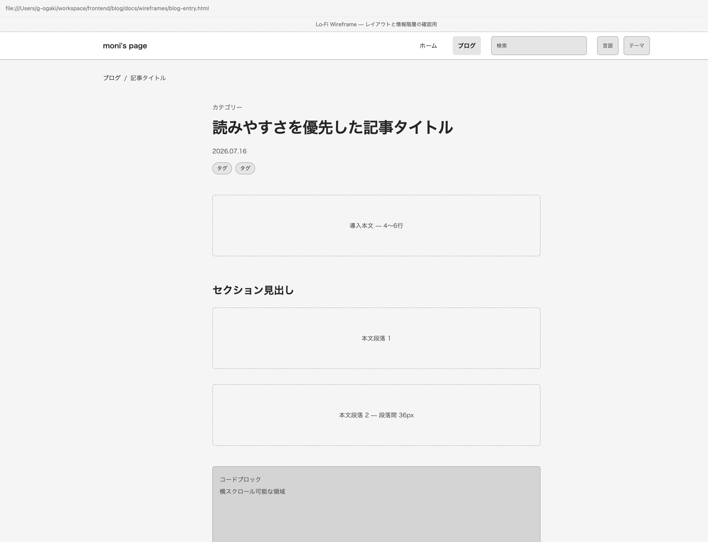
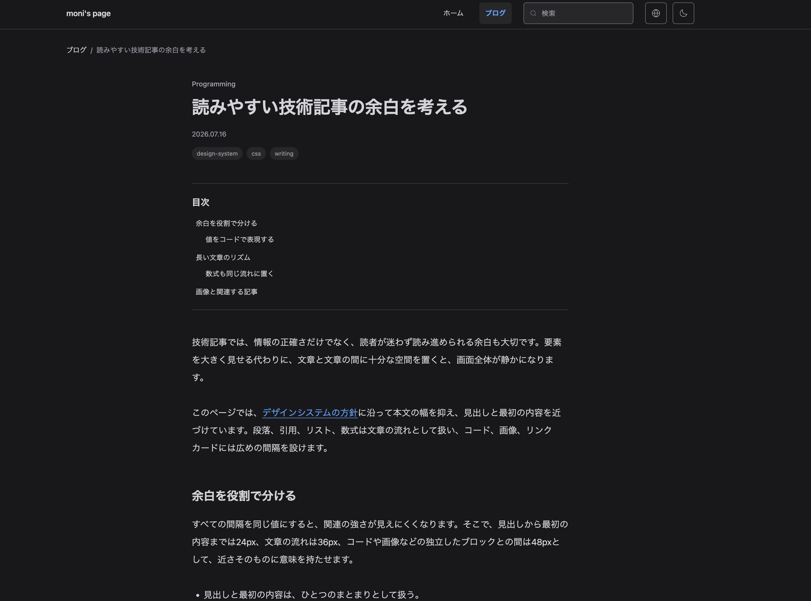
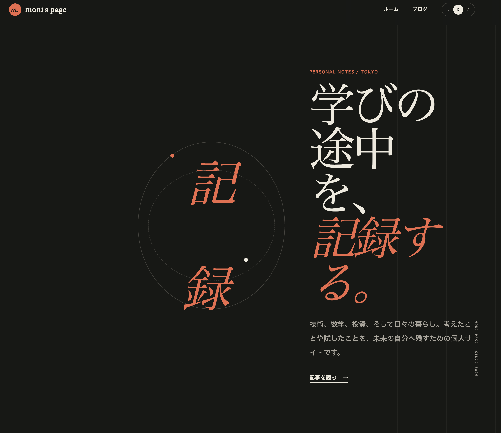

Codex CLI を使った初めての AI コーディングにて、大失敗で絶望に打ちひしがれながらどうにか完成まで辿り着いた記録です。

## 事前知識

AI コーディングには否定的だった私ですが、サムネイルにある AtCoder World Tour Final 2026 にて OpenAI が世界最高峰の競技プログラマーを圧倒したことを機に、少なくとも私程度のプログラマーはもはやコードを書くべきではないと認識を改めます:

https://hashout.jp/ai/3053/

時代に取り残されている私ですが、前職を辞める直前で AI コーディングの一端に触れる貴重な経験を得ます。当時運用保守していた社内システムがあったのですが、諸事情あり退職前にリファクターしてほしいと。辞めていく私より後任の方がやったほうがシステムの理解に繋がるという尤もらしい理由を盾に実装をお任せしたのですが、その方が AI 駆動開発ネイティブみたいな方で、レビュアーとしてプロジェクトを推進する中で vibe code の vibe を会得することができました。本サイト開発においても、効率的かどうかはさておきその際のワークフローを踏襲してみるということも目標の 1 つでした。具体的には以下を実際にやってみた感じです:

- テスト駆動開発で進める
- 改修箇所毎に issue を立てる
- feature ブランチを切り、issue に紐づけた PR により main ブランチへマージする

## ワークフロー

以下の 3 サイトを非常に参考にさせていただきました:

https://zenn.dev/yoshiko/articles/my-vibe-coding

https://blog.tsubotax.com/n/n184dd6925592

https://github.com/google-labs-code/design.md

実際には初めての vibe coding ということで試行錯誤と共に紆余曲折あったわけですが、(今考えると従うべきだった)大まかな流れは以下の通りです:

1. 「要件定義.md」や「技術スタック.md」など、仕様書兼 AI の外部記憶を AI に書いてもらう
1. `AGENTS.md` と `DESIGN.md` を AI に書いてもらう
1. GitHub や Cloudflare など開発環境を整える
1. vibe design でワイヤーフレームを生成しレイアウトを決定
1. vibe code で機能実装
1. ユーザー受け入れテスト

ここに登場する諸々の Markdown ファイルは以下リポジトリの root ディレクトリおよび `docs` ディレクトリにてご確認いただけます。ご覧になるのはもちろん歓迎ですが、大切なこととして私は `AGENTS.md` と `DESIGN.md` 以外ほとんど読んでおらず、加えて `AGENTS.md` で指示しているようにこれらのファイルは絶えず AI によって更新されております。人間と AI のインターフェースの役割も期待されていると思いますが、少なくともこのプロジェクトでは人間側である私の直接の介入はほとんどありませんでした。

https://github.com/g-ogaki/blog

### 1. 「要件定義.md」やその他諸々

このタイミングでは ChatGPT の Free プランであり、冒頭で述べた [vibe code](https://zenn.dev/yoshiko/articles/my-vibe-coding) の記事と同じく GPT の下位モデルを使用しました。記事では要件定義と技術選定のフェーズを分けていましたが、やってみたところ使う技術スタックや実装方針が直前に決めた要件定義と整合せず手戻りが発生したので、機能要件やデプロイ環境など一緒くたに壁打ちして全ての Markdown ファイルを最後に吐かせる方がよかったと思いました。

記事にも書いてありますが、基本的に AI が主導してくれるので、人間はただインタビューに答えるだけです。この辺りは私も知識がある(AI にやらせなくても時間をかければ自分でできる)部分なのでやり取りは綿密になりましたし、だからこそ機能面での手戻りは最小限に抑えられたと思います。しかし当然その分時間がかかるわけで、私の vibe code 初日はこのフェーズだけで終わりました。

### 2. `AGENTS.md` と `DESIGN.md`

初めて作る `AGENTS.md` でしたが、AI と会話するだけで特に何の苦労もなくできあがりました。[実物](https://github.com/g-ogaki/blog/blob/main/AGENTS.md)を見てもらえばわかりますが、テスト駆動開発やブランチルールであったり、コミット等には人間の承認が必要など、AI の立ち居振る舞いを制御するための簡潔な記述がなされているだけです。GPT 下位モデルに作らせると冗長な文章になってしまいましたが、Gemini Pro に添削させると無駄な部分をキュッと省いてくれたので、それをベースにして開発の中で AI に加筆修正させています。

難しかったのは `DESIGN.md` なのですが、これは私にデザインの知識がカケラもないためです。デザイナーであれば補色やアンチパターンなど様々な抽斗があるのでしょうけれど、こちらはズブの素人。`DESIGN.md` は Codex で作成しており、仕様書が置かれている `docs` を参照してもらうべく冒頭の Google の design.md のリポジトリをクローンし、これらを元に私に質問して `DESIGN.md` を作るように指示しました。同様にインタビューに答えるだけですが、以下のようなことを指示しました:

- シンプルで静かだけれども温かみがある
- 可能な限り Tailwind CSS で用意されている値を使う
- WCAG Contrast Ratio を遵守

逆を言えばデザインの知識がない分こだわりもないため、何かしらの基準に則ってアンチパターンに陥らないようにしてくれさえすれば良いというくらいのモチベーションでした。

そして私はやらなかったのですが、`DESIGN.md` の確認のため適当な HTML/CSS をこのタイミングで AI に作らせるべきでした。「たくさん質問されたしいい感じにしてくれてるやろ」と高を括っていましたが、生成された UI は黒白のコントラストが強すぎて目が痛くなるものでした(WCAG の遵守を優先するあまり無意味なほどに高い contrast ratio となった)。私はこれをワイヤーフレームのフェーズで行いましたが、明確な手戻りです。とはいえ開発が進むにつれどうしても修正しないといけない場面は往々にしてあるので、ここで決まったものは freeze しなければならないとは考えず、mutable なファイルであると柔軟な扱いで良いと思います。

### 3. 開発環境を整える

GitHub のリポジトリの作成であったり、Cloudflare にデプロイするため GitHub と連携する部分などは自前で揃えました。GitHub に関しては全部 AI に任せてしまってもよかったと思いますが、Cloudflare は CLI が私の知る限り充実しておらず、GUI でぽちぽちしながら最低限の接続を担保しました。vibe code 主体の本プロジェクトでもこの辺りは人間側に知識がある方がよさそうだと思った部分です。その後は実装に向けて、AI に実装内容を細分化させ、依存関係を考慮して適切な順番で並び替えた後に issue として登録させます。

### 4. ワイヤーフレーム

まずは lo-fi のワイヤーフレームをそれぞれのページで作成します。HTML ファイルが吐き出されるので、それをブラウザで表示し、Developer Tool で margin や font-size など色々いじりながら調整箇所をリストアップし AI に修正させます。そのため最低限の HTML/CSS および Developer Tool の使い方の知識があると便利ですが、私自身全然使いこなせていないので別になくてもどうとでもなると思います。この辺りは機能実装とは異なり私の主観で正解を定義しないといけないため、対 AI であろうが対デザイナーであろうが綿密なやり取りはどうしても発生します。

lo-fi のワイヤーフレームを使ってレイアウトが決まったら、`DESIGN.md` を元に本番相当の見た目となる hi-fi 版を生成させます。そして lo-fi のときと同じように細かな指示を行います。文言については Lorem Ipsum でも良い部分はありますが、この段階で極力本番に近づけておく方が予想しなかったデザインの修正などを減らせると思います。

### 5. 実装

ここが vibe code の真骨頂であり、人間の堕落フェーズです。既に仕様書一式は揃っているのですから、あとは AI に任せて YouTube でも見て時間を潰すだけです。ただ実装前には plan モードを挟んだ方がよく、不明瞭な箇所を AI に推測させるのではなく AI が質問として投げてくれます。プロンプトで漏れなく指示が出せるであったり実装内容が自明である場合などを除き、私は plan モードを挟み議論の余地を可能な限り潰しました。

### 6. ユーザー受け入れテスト

トップページと記事一覧ページは feature ブランチ毎に細かくチェックしていましたが、記事ページは現在執筆していることを以って UAT としています。実際に記事を書いてみて、「この部分が想定した挙動やレイアウトになっていない」や「この機能を実装させるの忘れてた」などいろいろ発見がありました。この記事を公開する前に AI に改修させます。

## 失敗談

### デザインの議論が全く出なかった要件定義

実は初期の機能要求事項は、Codex を使いはじめた初日にほとんど出来上がっておりました。しかし AI が作り出したプロダクトを見た途端に膝から崩れ落ちます:

ダッサッッッッッッッッッッッ！！！！！！！！！！！これが最新の GPT 5.6-Sol の考えるスタイリッシュなサイト！！！？？？？

いくらなんでもこれはないやろと思ったのですが、ここである気付きを得ます。「晩御飯なんでもいいよ」と伝えると、悪い意味で期待を裏切られるのと似ていませんか？あなたの言う「なんでもいい」は許容範囲が無意識に定まっており、それは「なんでもいい」という言葉で伝えられるものではないのです。

「こんなレイアウトになればいいな」といったアイディアが何一つないにも関わらず、要件定義の議論の際にデザインの話が全く出なかったことに違和感を持つべきでした。実のところ違和感はあったのですが、デザインから逃げに逃げてここまでやってきた私の忌避していた話題で、「AI が何も言ってこない＝よしなにやってくれる」という AI の特性と真反対のことを信じて現実逃避していただけです。残念なことに私の頭の中にないものは具現化されないので、観念してデザインの一端を学ぶことにしました。

### デザインシステム

カスみたいなレイアウトに仕上がってしまったので、手直しをしないといけません。Gemini に現状の惨劇を伝えたところ、たくさんデザインを見て参考にしたいサイトをピックアップし、どの箇所を採用してどの箇所は取り入れないようにするかリストアップしろとのことでした。何個か取り上げて `docs` に作成した新しいファイルに書き留め、これを元にレイアウトを改修するよう AI に伝えます。しかし指示の仕方が悪いのかどうしようもないのか、見た目への変更はほとんどなされませんでした。既に出来上がっているものがある場合それを保持しようとするのか、抜本的な改修プロセスを経ない限り期待した修正は難しいのだと思います。

ついにワイヤーフレームを自分で作らなければならないのかと思いはじめ、機能面だけは完璧なこのプロダクトを捨てようかとも考えました。しかしこれまで大抵のことは AI になすりつけてどうにかしてきたので、デザインの部分だって大半は AI に任せて必要な学習を最小限に抑えられるのではないかと考え始めます。検索したり AI に聞いたりする中で見つけたのが冒頭に挙げた [vibe design](https://blog.tsubotax.com/n/n184dd6925592) の記事だったり、`DESIGN.md` を説明した [Qiita 記事](https://qiita.com/y-morimatsu/items/0271f85171f4ea084aea)だったりするわけです。vibe design の記事では [Komorebi UI](https://assets.st-note.com/img/1771819035-vZxPXe49kuTzRfitqd8KHNaw.png?width=4000&height=4000&fit=bounds&format=jpg&quality=90) というかっこいいデザインシステムが挙げられていましたが、デザインのことが何もわからない私には作成が厳しいと感じ、同じくデザインシステムを記述するファイルとして Google が標準化しようとしている `DESIGN.md` に賭けることにしました。

### レイアウト

`DESIGN.md` にベットした賭けには勝利して AI っぽくない見た目に仕上がるわけですが、とは言え前述の通り頭の中にすらないレイアウトが目の前に現れるわけもないので、仕方なく考案に時間を割きます。といいつつこのサイトは note.com、Qiita、はてなブログといった主要なブログサイトのような使い心地と機能を目指していたので、レイアウトなんてのはこれらのいいとこ取りをすれば済む話です。トップページが最も頭を悩ませましたが、同じようにさまざまな個人ブログのトップページを見てまわり、良さそうなものを拾い集めてきました。

レイアウトが決まったら、その先はワイヤーフレームに進んで...という感じです。従って実際に私が行ったワークフロー順は 1. -> 2. (`DESIGN.md` 以外) -> 3. -> 5. -> 6. -> 2. (`DESIGN.md`) -> 4. -> 5. -> 6. という、富豪のようなトークンの使い方をする手戻りだらけな手順だったわけです。

## ポストモーテム

### レイアウト崩れ

vibe design の記事では vanila HTML/CSS で lo-fi および hi-fi のワイヤーフレームを作成していたように見受けられたので、私もこれに従いました。ある程度納得できたところで本実装するように AI に伝えると、ワイヤーフレームとは表示の異なる箇所が多数発生しました。表示する文言まで変わってしまっていた箇所もあるなど、「レイアウトは厳密にワイヤーフレームに従って」といった指示しなかった私の落ち度でもありますが、このような差は再度それを指示すれば修正できます。しかし問題だったのはアプリ内で使用されている Tailwind CSS の リセット CSS に起因するレイアウト崩れで、結局 vanilla CSS で確認したのちに Tailwind CSS でも確認するという二度手間が発生しました。

「ワイヤーフレームの時から Tailwind CSS を使うべきだった？」と Gemini に質問すると "Definitely yes" との返答。その上「Next.js + Tailwind CSS で開発することが決まっているのなら、`` タグと `<Image>` コンポーネントの違いなどによるレイアウト崩れの可能性もあるんだから、ワイヤーフレームから Next.js でやった方がいい」と。

実は Next.js の方にすべきだった理由がもう 1 つあります。3 枚のワイヤーフレームを順に作成したのですが、後になって header や footer の共通部分への変更を指示するとご丁寧に全てのワイヤーフレームに修正を加えます。これはコンポーネント単位で実装する React を使用していれば避けられた話です。Next.js 上でワイヤーフレームを作成してもトークン消費に大差はないでしょうし、意味もなく環境を切り分けて再検証が発生するのは無駄そのものだったので、今回の大きな反省点でした。

### 不要なユニットテスト+不明瞭な End-to-End テスト

ネイティブバイブコーダーだった前職の後輩を倣ってテスト駆動開発 (TDD) を行いましたが、今回の用途では無駄だったと思います。大切な分水嶺として「あなたは AI の書いたコードを読むのかどうか」の 2 択があり、こんなステークホルダーの存在しない個人開発においてコードを読む気などさらさらありません。加えて TDD に従うよう AI に指示すると夥しい数のユニットテストを生成します。機能追加と共に膨れ上がるテストケースを横目に「TDD なんかやらなきゃよかった」という思いが募ります。

それとは対照的に、PR が作成され Cloudflare で preview URL が発行された際に行う E2E テストについては何をチェックすべきか事前に列挙した方がよかったと思います。「この辺り見ておけばええやろ」とザルみたいなチェックを行いマージした後、モバイルビューではレイアウトが崩壊するみたいなことが発生し、関連しない別の issue で対応するという行儀の悪いことをしていました。

### 初期開発 vs. 機能追加

機能毎に issue を切って細かく開発していくスタイルは、リファクターのようにある程度初期開発が終わり調整していくフェイズでは有用だったと思います。一方で何もないところから叩き台を作るところまでは「うまいこと作っておいて」と AI に丸投げした方がよかったと考えます。ご丁寧に設定ファイル等の配置も issue を分けて PR を作ってくれましたが、ほとんど読みもせずに承認してマージするなど無意味な人間の介入を要求する結果となり、人間も AI も得しないワークフローになってしまった印象です。

## よくわかんなかった方へ

せっかくコメント機能を実装した(これだけのために本サイトが完全な SSG にはならず、データベースもこのためだけに存在している)ので、ぜひご質問いただけたら。Discord に通知が飛ぶように設定してあるので、気付き次第対応いたします。